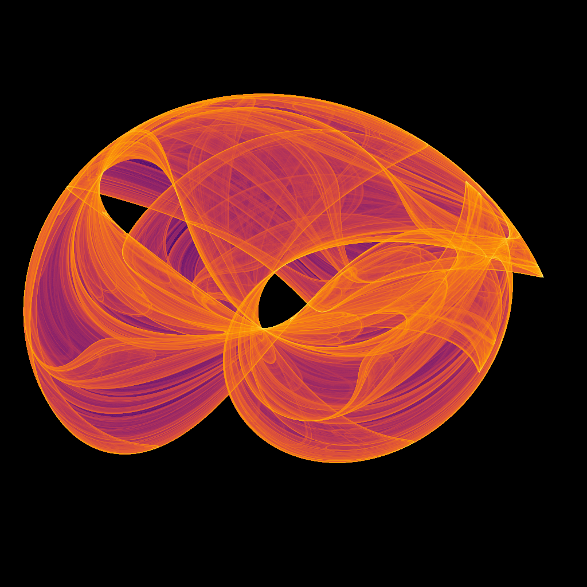
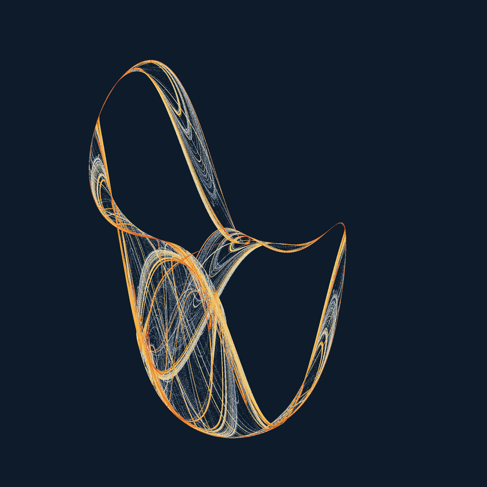
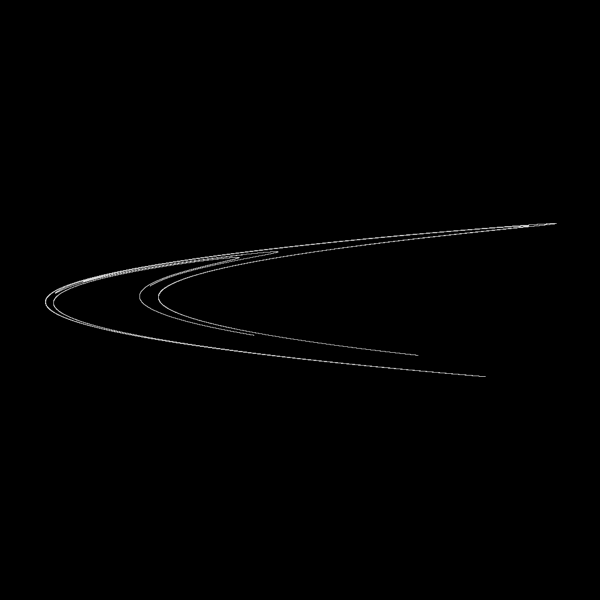
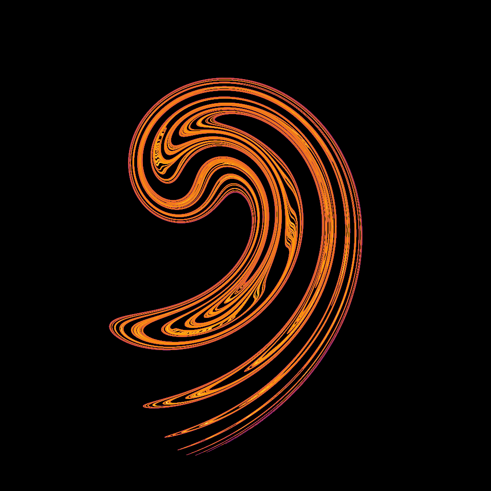
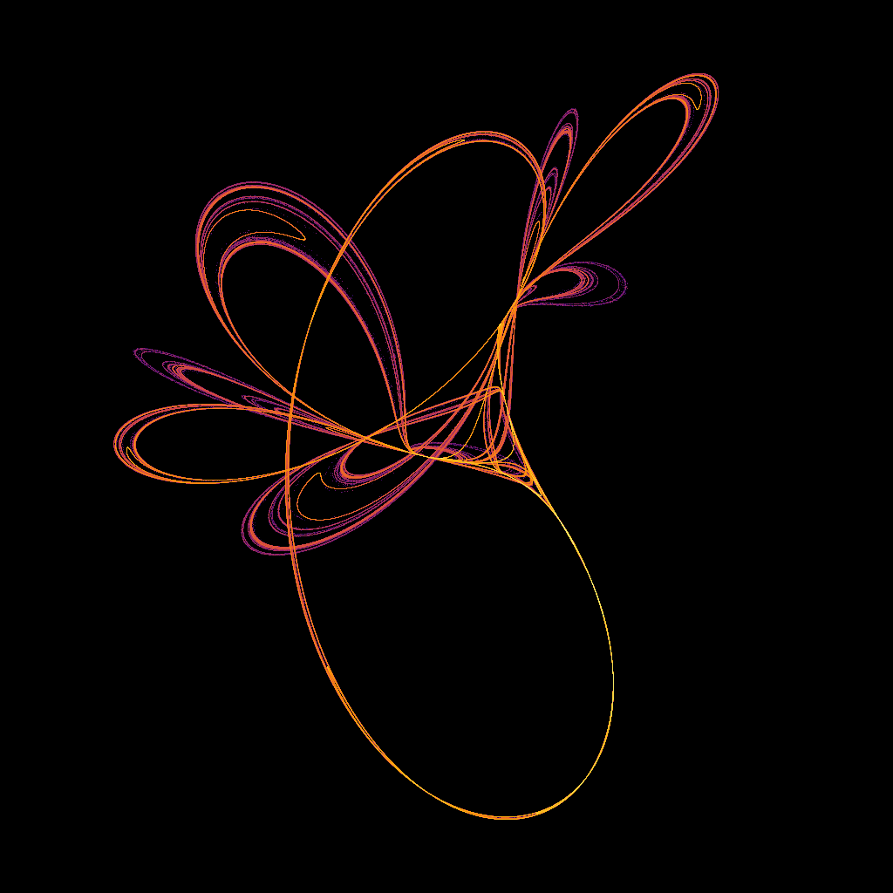
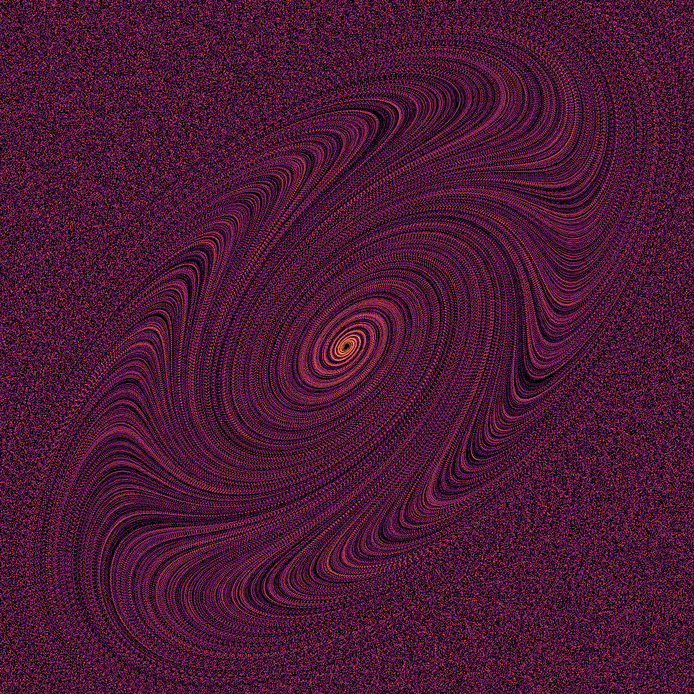
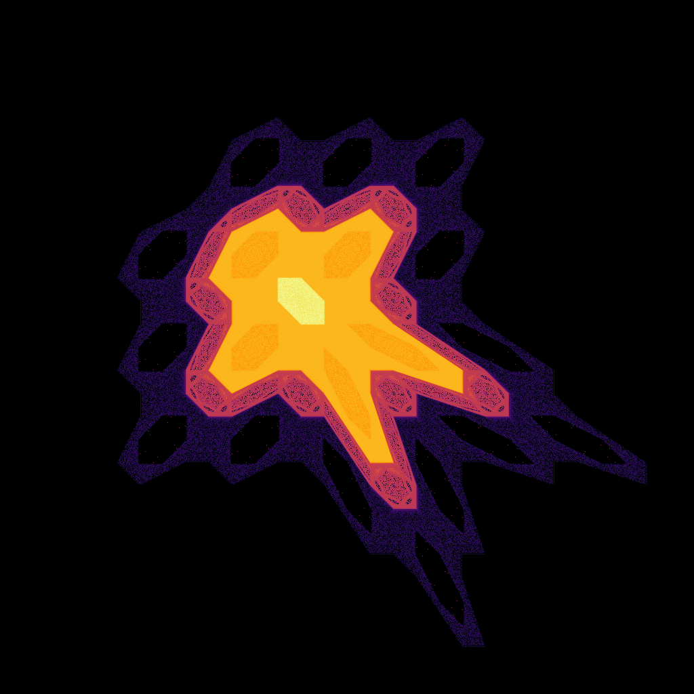
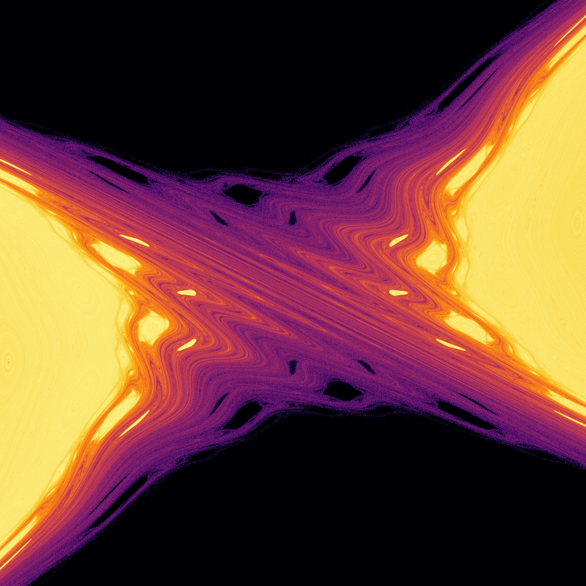

# Attract

[](https://crates.io/crates/attract)
[](https://docs.rs/attract)
[](LICENSE)

Generate beautiful mathematical art with the power of chaos theory and Rust's performance.

## Features

- **Multiple Attractor Types**: Clifford, De Jong, Hénon, Ikeda, Tinkerbell, Duffing, Chirikov Standard Map, and Gingerbreadman
- **Flexible Sampling**: Gaussian, circular, and axis-aligned bounding box generators for initial conditions
- **High Performance**: Multi-threaded rendering with configurable parallelization
- **Generic Design**: Works with any floating-point type (`f32`, `f64`)
- **Memory Efficient**: Density-based rendering that scales to millions of sample points
- **Progress Tracking**: Built-in progress bars for long-running computations

## Quick Start

Add this to your `Cargo.toml`:

```toml
[dependencies]
attract = "0.0.0"
```

### Basic Example

```rust
use attract::{Clifford, Generator, Settings, render};
use nalgebra::Complex;

// Create a Clifford attractor with classic parameters
let attractor = Box::new(Clifford::new(-1.4, 1.6, 1.3, 0.7));

// Set up a Gaussian generator for initial sampling points
let generator = Generator::Gaussian {
    centre: Complex::new(0.0, 0.0),
    std_dev: 1.0,
};

// Configure rendering settings
let settings = Settings {
    attractor,
    generator: &generator,
    resolution: [1024, 1024],
    offset: [0.0, 0.0],
    scale: 5.0,
    num_samples: 1_000_000,
    num_groups: 100,
    max_iter: 10_000,
    warmup: 1_000,
};

// Render the attractor
let density_map = render(&settings);

// The density_map is a 2D array where each cell contains
// the number of points that visited that pixel
```

## Supported Attractors

### Clifford Attractor

One of the most visually striking attractors, generating intricate butterfly-like patterns.



**Equations:**

- `x_{n+1} = sin(a * y_n) + c * cos(a * x_n)`
- `y_{n+1} = sin(b * x_n) + d * cos(b * y_n)`

```rust
let clifford = Clifford::new(-1.4, 1.6, 1.3, 0.7);
```

### De Jong Attractor

Creates organic, flowing patterns with four parameters controlling the dynamics.



**Equations:**

- `x_{n+1} = sin(a * y_n) - cos(b * x_n)`
- `y_{n+1} = sin(c * x_n) - cos(d * y_n)`

```rust
let de_jong = DeJong::new(-2.0, -2.0, -1.2, 2.0);
```

### Hénon Map

A classic discrete-time dynamical system that exhibits chaotic behavior.



**Equations:**

- `x_{n+1} = 1 - a * x_n^2 + y_n`
- `y_{n+1} = b * x_n`

```rust
let henon = Henon::new(1.4, 0.3);
```

### Ikeda Map



Models the behavior of light in an optical cavity, creating spiral patterns.

**Equations:**

- `t = 0.4 - 6.0 / (1 + x_n^2 + y_n^2)`
- `x_{n+1} = 1 + u * (x_n * cos(t) - y_n * sin(t))`
- `y_{n+1} = u * (x_n * sin(t) + y_n * cos(t))`

```rust
let ikeda = Ikeda::new(0.918);
```

### Tinkerbell Map



A four-parameter map that produces fairy-like patterns, often used in fractal art.

**Equations:**

- `x_{n+1} = x_n^2 - y_n^2 + a * x_n + b * y_n`
- `y_{n+1} = 2 * x_n * y_n + c * x_n + d * y_n`

```rust
let tinkerbell = Tinkerbell::new(0.9, -0.6013, 2.0, 0.5);
```

### Duffing Attractor



A chaotic oscillator model that simulates the behavior of a forced, damped oscillator.

**Equations:**

- `x_{n+1} = y_n`
- `y_{n+1} = -b * x_n + a * y_n - y_n^3`

```rust
let duffing = Duffing::new(-1.0, 1.0);
```

### Gingerbreadman Attractor



A unique attractor with a distinctive shape, defined by a simple iterative process.

**Equations:**

- `x_{n+1} = 1 - y_n + |x_n|`
- `y_{n+1} = x_n`

```rust
let gingerbreadman = Gingerbreadman::new();
```

### Chirikov Standard Map



A map that exhibits chaotic behavior in Hamiltonian systems, often used in studies of chaos.

**Equations:**

impl<T: Float + Copy> Attractor<T> for Chirikov<T> { #[inline]
fn iterate(&self, p: Complex<T>) -> Complex<T> {
let x = p.re; // position
let p_momentum = p.im; // momentum

        let p_new = p_momentum + self.k * x.sin();
        let x_new = x + p_new;

        Complex::new(x_new, p_new)
    }

}

- `x_{n+1} = x_n + p_n`
- `p_{n+1} = p_n + k * sin(x_n)`

### Bring Your Own Attractor

The library is designed to be extensible. You can implement your own custom attractors by simply implementing the `Attractor` trait:

```rust
use attract::Attractor;
use nalgebra::Complex;
use num_traits::Float;

// Example: A simple custom attractor
#[derive(Debug, Clone, Copy)]
pub struct MyCustomAttractor<T> {
    param_a: T,
    param_b: T,
}

impl<T> MyCustomAttractor<T> {
    pub const fn new(a: T, b: T) -> Self {
        Self { param_a: a, param_b: b }
    }
}

impl<T: Float + Copy> Attractor<T> for MyCustomAttractor<T> {
    fn iterate(&self, p: Complex<T>) -> Complex<T> {
        // Define your custom iteration equations here
        let x = p.re;
        let y = p.im;
        Complex::new(
            // Your x_{n+1} equation
            self.param_a * x + self.param_b * y.sin(),
            // Your y_{n+1} equation
            y * x - self.param_a
        )
    }
}

// Your custom attractor now works with all rendering functions!
let custom_attractor = Box::new(MyCustomAttractor::new(1.2, 0.8));
let settings = Settings {
    attractor: custom_attractor,
    // ... rest of your settings
};
let result = render(&settings);
```

Once you implement the `Attractor` trait, your custom attractor is immediately compatible with all the library's rendering functions, sampling methods, and performance optimizations.

## Sampling Generators

Control how initial points are distributed in the complex plane:

### Gaussian Distribution

```rust
let generator = Generator::Gaussian {
    centre: Complex::new(0.0, 0.0),
    std_dev: 1.0,
};
```

### Circular Region

```rust
let generator = Generator::Circle {
    centre: Complex::new(0.0, 0.0),
    radius: 2.0,
};
```

### Rectangular Region

```rust
let generator = Generator::Aabb {
    centre: Complex::new(0.0, 0.0),
    half_size: Complex::new(1.0, 1.0),
};
```

## Performance Optimization

### Multi-threading

Control parallelization with the `num_groups` parameter:

```rust
let settings = Settings {
    // ... other settings
    num_groups: 100,  // Adjust based on your CPU cores
    // ...
};
```

### Memory vs Quality Trade-offs

- **Higher `num_samples`**: Better quality, more computation time
- **Higher `max_iter`**: More detailed attractors, slower rendering
- **Larger `resolution`**: Higher detail, more memory usage
- **`warmup` iterations**: Skip transient behavior, focus on the attractor

### Recommended Settings

For **quick previews**:

```rust
num_samples: 100_000,
max_iter: 1_000,
resolution: [512, 512],
```

For **high-quality renders**:

```rust
num_samples: 10_000_000,
max_iter: 50_000,
resolution: [2048, 2048],
```

## Advanced Usage

### Custom Viewport

Focus on specific regions of the attractor:

```rust
let settings = Settings {
    // ... other settings
    offset: [1.2, -0.8],  // Center the view here
    scale: 2.0,           // Zoom level (smaller = more zoomed in)
    // ...
};
```

### Generic Float Types

Use different precision levels:

```rust
// High precision
let attractor = Box::new(Clifford::<f64>::new(-1.4, 1.6, 1.3, 0.7));

// Fast computation
let attractor = Box::new(Clifford::<f32>::new(-1.4, 1.6, 1.3, 0.7));
```

## Output Processing

The `render` function returns a 2D density array (`Array2<u32>`) where each cell contains the visit count for that pixel. You can:

1. **Apply logarithmic scaling** to enhance visibility of low-density regions
2. **Convert to images** using your preferred image processing library
3. **Apply color maps** for artistic visualization
4. **Perform statistical analysis** on the density distribution

## License

This project is licensed under the MIT License - see the [LICENSE](LICENSE) file for details.

## Contributing

Contributions are welcome! Please feel free to submit a Pull Request. Areas where contributions would be particularly valuable:

- Additional attractor implementations
- Performance optimizations
- New sampling methods
- Documentation improvements
- Example applications
